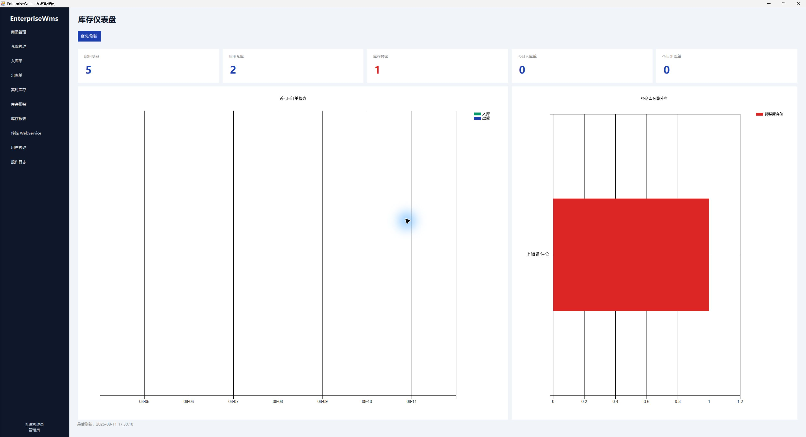
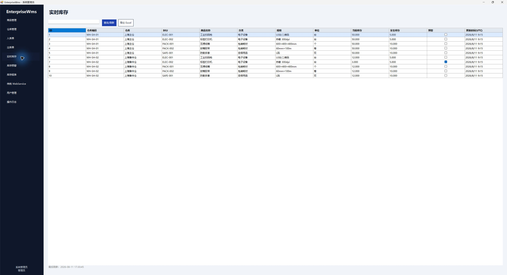
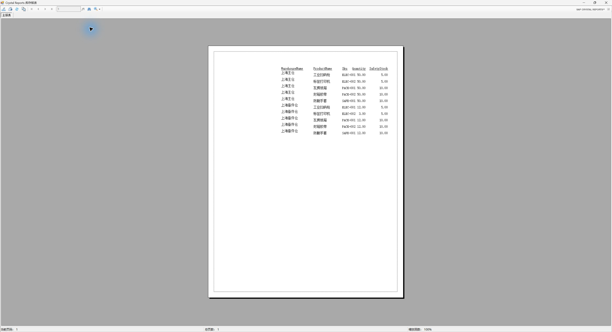

# EnterpriseWms 企业仓储管理系统

[](https://github.com/ycr80/EnterpriseWms/actions/workflows/backend-ci.yml)

EnterpriseWms 是一个基于 C#/.NET 的企业仓储管理系统：以 ASP.NET Core Web API 和 EF Core 为业务后端，以 .NET Framework 4.8 WinForms 为桌面管理端，并通过 SQL Server 存储过程保证并发出库的数据一致性。

## 技术栈

- .NET 10 LTS、ASP.NET Core Web API、JWT、Swagger/OpenAPI
- EF Core 10、SQL Server Express LocalDB、视图、存储过程、表值参数
- .NET Framework 4.8 WinForms（x64）、REST、WCF `BasicHttpBinding` SOAP/WSDL
- ClosedXML Excel 导出、SAP Crystal Reports for Visual Studio SP40 x64
- xUnit、真实 LocalDB 集成测试

## 已实现功能

- 商品、仓库、实时库存、安全库存、库存预警和组合检索。
- 多明细入库、出库即时过账，单据过账后不可修改或删除。
- SQL Server 事务、`UPDLOCK/HOLDLOCK`、库存不足整单回滚和库存流水。
- 管理员、仓库操作员、只读查看员三角色 JWT 授权。
- 操作日志、库存仪表盘、近七日订单趋势、Excel 报表和 Crystal Reports 库存预览。
- REST API、Swagger 和只读 SOAP/WSDL 库存查询服务。
- 中文 WinForms 管理端及按角色裁剪的侧边菜单。

## 快速开始

### 获取代码

```powershell
git clone https://github.com/ycr80/EnterpriseWms.git
Set-Location EnterpriseWms
```

### 前置环境

1. Visual Studio 2022，并安装“.NET 桌面开发”、“.NET Framework 4.8 Targeting Pack”和“SQL Server Express LocalDB”组件。
2. .NET 10 SDK。
3. 如需 Crystal Reports：注册并安装 [SAP Crystal Reports for Visual Studio SP40 x64](https://www.sap.com/registration/trial.9a4afb3b-7eaa-42af-98ce-abeae5deb784.html) 及 x64 Runtime。SAP 不允许随项目重新分发设计器，因此仓库不包含安装包。

只运行后端、Swagger、SOAP、Excel 和自动化测试时不需要安装 Crystal Reports；Crystal 仅用于 net48 WinForms 报表预览和 PDF 导出。

### 初始化与运行

```powershell
powershell -ExecutionPolicy Bypass -File .\scripts\setup.ps1
powershell -ExecutionPolicy Bypass -File .\scripts\run-demo.ps1
```

`setup.ps1` 会随机生成 JWT/SOAP 密钥到 Git 忽略文件，应用 EF Migration，创建视图和存储过程，写入演示数据并构建解决方案。默认数据库名为 `EnterpriseWms`；需要创建独立验收库时可执行：

```powershell
powershell -ExecutionPolicy Bypass -File .\scripts\setup.ps1 -DatabaseName EnterpriseWmsAcceptance
```

API 地址：`http://localhost:5080`  
Swagger：`http://localhost:5080/swagger`  
WSDL：`http://localhost:5080/soap/StockQueryService.svc?wsdl`

### 演示账号

| 角色 | 用户名 | 密码 |
|---|---|---|
| 管理员 | `admin` | `Admin123!` |
| 仓库操作员 | `operator` | `Operator123!` |
| 只读查看员 | `viewer` | `Viewer123!` |

账号仅用于本地演示，首次真实部署必须修改。

## 权限边界

| 能力 | 管理员 | 操作员 | 查看员 |
|---|:---:|:---:|:---:|
| 查看主数据、库存、报表 | ✓ | ✓ | ✓ |
| 创建入库/出库单 | ✓ | ✓ |  |
| 管理商品、仓库、安全库存 | ✓ |  |  |
| 管理用户、查看操作日志 | ✓ |  |  |

WinForms 菜单裁剪只改善体验，真正的授权边界在后端 Policy。

## 测试

```powershell
powershell -ExecutionPolicy Bypass -File .\scripts\build.ps1
```

关键集成场景：

- 多明细入库同时写入库存与库存流水。
- 第二个商品库存不足时，整张出库单及第一个商品扣减全部回滚。
- 两个请求并发从库存 10 各出库 7，最终仅一个成功，库存为 3。

未安装 LocalDB 时，数据库测试会明确显示为 `Skipped`，不会伪装成通过。当前交付环境已完成真实 LocalDB 验证，18 项测试全部通过且 0 跳过，覆盖事务回滚、并发出库、登录/JWT、三角色权限、HTTP 409 ProblemDetails、组合筛选分页、停用商品历史追溯、Excel 内容和 SOAP Fault。

## 项目资料

- [架构与数据库设计](docs/ARCHITECTURE.md)
- [REST API 摘要](docs/API.md)
- [Crystal Reports 接入说明](docs/CRYSTAL_REPORTS_SETUP.md)
- [端到端验收记录](docs/ACCEPTANCE.md)
- [Crystal Reports PDF 验收产物](docs/CrystalInventoryReport-Acceptance.pdf)

## 运行截图

### 管理员库存仪表盘



### 实时库存与预警状态



### Crystal Reports 库存报表



## 当前环境说明

代码已在 .NET 10 SDK 下完整构建，包含 net48 x64 WinForms；SQL Server Express LocalDB、.NET Framework 4.8 Developer Pack、ASP.NET/Web 与 .NET 桌面工作负载均已安装。真实 LocalDB 的 API、事务、权限、报表和并发测试 18/18 通过。独立数据库 `EnterpriseWmsAcceptance_20260811` 已从零应用迁移和种子数据，并完成登录、入库、出库、库存核对、Excel、WSDL 与健康检查。当前验收环境已安装 SAP Crystal Reports SP40 x64（13.0.40.5789），已使用 REST 返回的 10 条库存记录完成中文预览和 PDF 导出；仓库不重新分发 SAP 安装包。
