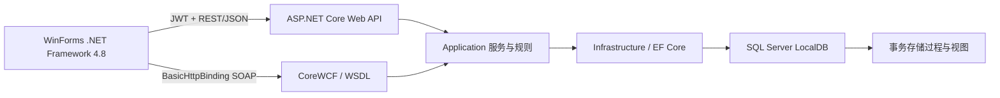
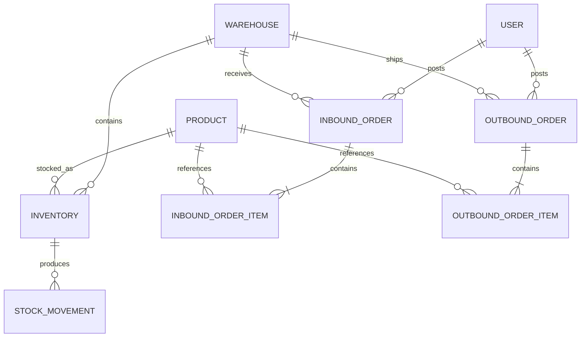
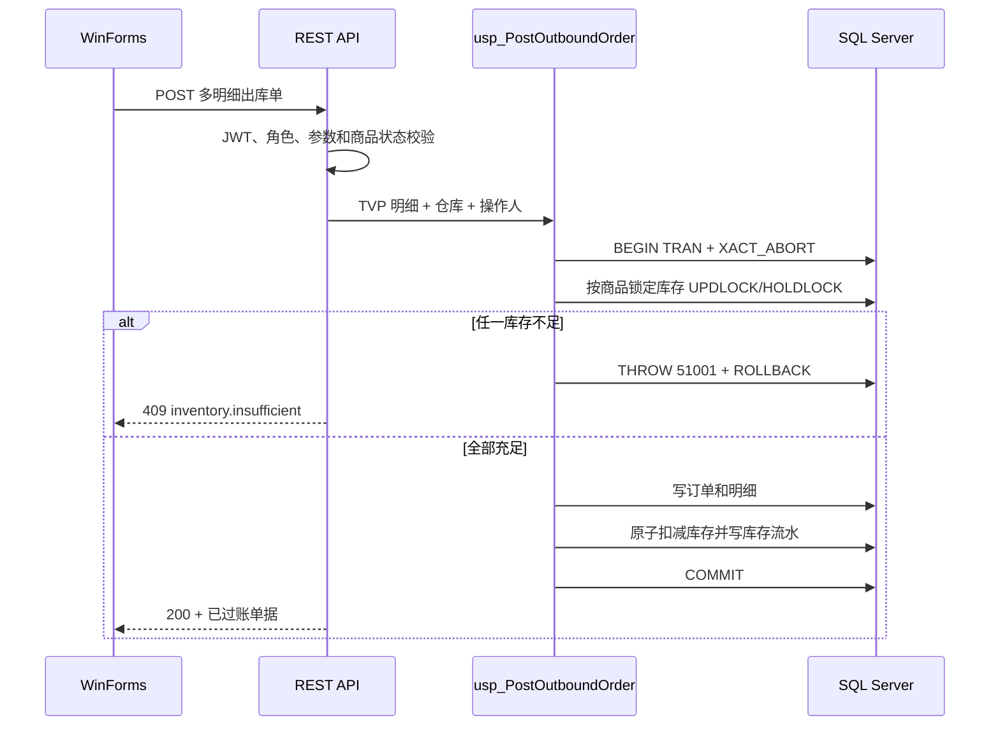

# 架构与数据库设计

## 分层

- `Contracts` 目标为 .NET Standard 2.0，使现代 API 与 net48 客户端共享 REST DTO。
- `Domain` 保存领域实体和固定角色。
- `Application` 定义用例接口、业务异常与订单校验。
- `Infrastructure` 实现 EF Core、主数据、库存、订单、报表及种子数据。
- `Api` 负责 JWT、Policy、统一 ProblemDetails、REST、SOAP 和操作日志。

## ER 模型

商品 SKU、仓库编码、用户名以及“仓库 + 商品”库存位均有唯一索引。商品和仓库使用 `IsActive` 停用，历史单据永不级联删除。

## 出库一致性

应用层库存判断只能改善错误提示，最终一致性由数据库事务和锁保证。出库明细按商品 ID 排序传入，减少不同请求锁顺序不一致造成的死锁概率。

## SQL 对象

- `vw_CurrentInventory`：实时库存、商品和仓库的统一查询口径。
- `vw_InventoryWarnings`：当前库存不高于安全库存的库存位。
- `StockOrderItemType`：多明细单据的表值参数。
- `usp_PostInboundOrder`：原子写入入库单、库存和流水。
- `usp_PostOutboundOrder`：锁定、校验、扣减、写单和流水。
- `usp_GetInventoryReport`：报表统一数据源。

数据库保存 UTC，客户端按 Asia/Shanghai 展示。
